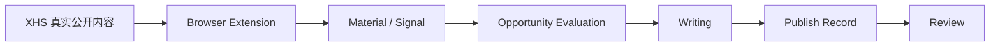

# 小红书 AI 内容运营工作台

面向内容创作者的本地优先 AI 内容决策工作台。它不是一个只负责生成文字的 AI 写作工具，而是把真实平台证据整理成可解释的内容决策流程：先判断“写什么、为什么值得做、证据是否完整”，再进入创作、发布记录和复盘。

## 1. 项目简介

这个项目服务于需要持续运营小红书账号、但不想只凭感觉选题的内容创作者。系统从用户在正常登录会话中采集的真实公开内容开始，形成素材（Signal），再生成可追溯的机会判断、可编辑草稿和人工复盘记录。

核心工作流是：

**素材 → 机会 → 创作 → 复盘**

判断层会明确展示真实引用、判断理由、置信度和缺失证据。缺少 baseline、cluster 或账号资料时，流程会降低置信度并说明原因，而不是伪装成完整结论或直接让产品停止。

## 2. 为什么做

内容运营最耗时的部分通常不是把句子写出来，而是：

- 发现值得关注的内容和选题；
- 判断它是否真的值得投入；
- 验证判断背后的平台证据；
- 把判断整理成可执行的内容方案；
- 发布后回看结果并修正下一轮决策。

这个工作台把这些步骤放在同一条证据链中，帮助创作者在“写什么”之前先做一次可解释的机会判断。

## 3. 核心工作流



## 4. 当前功能

### 已实现

- 真实小红书单笔记采集；
- 博主资料采集；
- 博主近期笔记 baseline；
- Signal / Observation merge；
- Creator canonical identity；
- 素材库；
- Signal-only Opportunity；
- evidence degradation；
- baseline optional、cluster optional、matching optional；
- Opportunity → Brief → Draft；
- 可编辑草稿和 `drafts.json` 持久化；
- PublishRecord；
- 24h / 72h 人工复盘；
- 小红书账号事实同步；
- 本地优先 persistence。

### 已真人验证

当前已有真实小红书会话验证记录的路径包括：

- 小红书真实笔记采集；
- Creator profile；
- Creator baseline batch；
- canonical creator linkage；
- Discovery baseline；
- Signal → Opportunity；
- Opportunity → Writing renderer。

这里的“真人验证”只表示相应路径曾在真实平台会话或真实内容链路中验证过，不代表所有自动化采集和发布场景都已完成验收。

### Deferred / Known limitations

- XHS keyword / visible search batch 暂缓；
- 自动发布未实现；
- 账号画像的历史本人笔记关联仍待完善；
- AI profile fallback 的真人 UI 尚有待完善；
- Publish / Review 已实现，但尚未完成完整真人发布验证；
- 当前优先验证产品闭环，不追求生产级自动化；
- Electron 内嵌 Collector 和 Beav Native/Desktop whole-stack 仅作为历史实验保留，不是当前主流程。

## 5. 本地运行

需要 Node.js 20+。开发预览和桌面工作台使用现有脚本：

```bash
npm ci
npm run build
npm run desktop
```

真实小红书采集使用 Chrome / Edge 中的 unpacked extension，加载：

```text
extension/beav-redbook/src
```

桌面工作台启动后提供本机 Connector；扩展把 Beav 已提取的结构化 note / creator payload 送入本地 SignalStore、CreatorStore 和后续机会判断。扩展不读取或导出 Cookie、密码、Token 或登录凭证。

常用验证命令：

```bash
npm test
npm run build
npm run desktop:smoke
npm run desktop:collector-smoke
npm run desktop:lifecycle-smoke
```

## 6. Screenshots

仓库当前只保留应用 logo 和扩展图标，没有把包含真实账号、Cookie、Token 或本地路径的运行截图提交到 GitHub。面试演示时建议使用脱敏后的现场截图展示浏览器采集助手、素材库、机会判断、Writing 草稿和 Review 页面。

## Open-source attribution

Browser extension / XHS capture runtime 的部分实现基于或参考 Beav 开源项目：

- 上游项目：[Jamailar/Beav](https://github.com/Jamailar/Beav)
- 署名与边界：[`docs/BEAV_ATTRIBUTION.md`](docs/BEAV_ATTRIBUTION.md)
- 完整第三方声明：[`THIRD_PARTY_NOTICES.md`](THIRD_PARTY_NOTICES.md)
- 随项目保留的许可证：[`vendor/beav/LICENSE`](vendor/beav/LICENSE)

相关 Beav 代码受 **MIT License – Non-Commercial Use Only** 约束。这个仓库不是把整个项目标成纯 MIT；使用、分发或商业化时必须同时遵守上游许可证和署名要求。

## Architecture

系统把“通用采集能力”和“内容决策能力”分层：

### Beav-derived layer

- XHS response interception；
- page observer；
- browser collection；
- task queue。

### Redbook-owned layer

- Connector；
- SignalStore；
- CreatorStore；
- Observation semantics；
- Opportunity evaluation；
- evidence degradation；
- account matching；
- Writing；
- DraftStore；
- PublishRecord；
- Review。

Beav 负责通用采集能力，Redbook 的业务增量集中在“真实平台证据 → 内容机会判断”，并把判断结果继续连接到创作和复盘。

## Key product / engineering decisions

1. **Browser Extension 替代 Electron 内嵌网页采集**：真实浏览器登录态更稳定，也减少 Electron MAIN world、context isolation 和页面生命周期之间的复杂度。
2. **Capture 与 Analysis 分层**：采集层只负责拿到真实平台数据；Signal、Opportunity 和 Writing 层独立处理，便于测试、追踪证据和替换入口。
3. **Evidence degradation**：缺少 baseline、cluster 或 account profile 时降低 confidence，并显示 missing evidence，而不是用硬门槛阻塞整个工作流。
4. **Human-in-the-loop**：v0.1 保留人工选择、编辑、发布和复盘，不把自动发布当成默认行为。
5. **Reuse over rewrite**：优先复用成熟的开源采集能力，只实现 Redbook 的连接器、证据语义和内容决策差异。

## Project status

**Status：Interview Prototype / Local-first MVP**

**Current milestone：Material → Opportunity → Writing core loop validated with real Xiaohongshu content.**

项目目前适合作为求职与面试展示的真实 AI 产品原型，而不是 Production Ready 软件。展示时应同时说明：已验证的真实链路、仍需人工验收的部分，以及从 Electron Collector 实验转向浏览器扩展的工程取舍。

## Security / privacy boundary

- 只处理用户正常登录会话中已经公开、可见的页面内容；
- 不读取、导出或保存 Cookie、密码、Token 或服务端密钥；
- 本地 runtime 数据放在用户数据目录，不应提交到 GitHub；
- 不绕过验证码、风控或平台登录安全提示；
- 未知字段保持为空或“暂无”，不使用 fixture 冒充真实平台数据。

更多架构、采集边界和发布前审计见 [`docs/ARCHITECTURE.md`](docs/ARCHITECTURE.md)、[`docs/RELEASE_RC_TEST_MATRIX.md`](docs/RELEASE_RC_TEST_MATRIX.md) 和 [`docs/V0_1_0_RELEASE_READINESS.md`](docs/V0_1_0_RELEASE_READINESS.md)。
